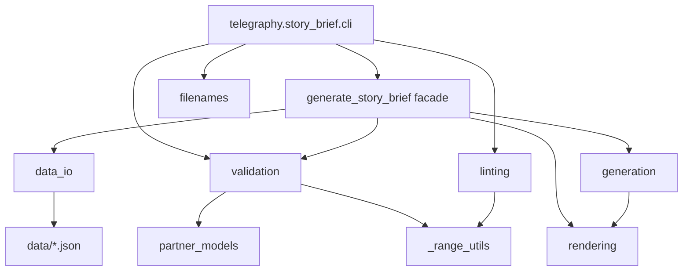
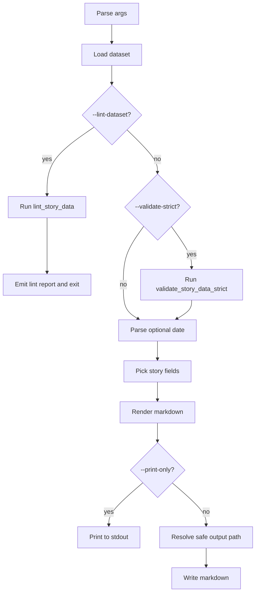

[](https://sonarcloud.io/summary/new_code?id=jeffreywevans_Telegraphy)


# **Telegraphy**

---

## **📚 Commuted Telegraphy Archive Primer**  

*“This is not the story. This is how to *build* the story.”*

---

## **🗨️ INTRODUCTION**

Welcome. You’ve found the vault.

This is the official documentation archive of **Commuted Telegraphy**. This project blends **fiction and fact, real people and invented moments**, and is filtered through a style best described as **sacred realism with a taste for sweat and feedback**.

The world exists from **1989 to 2032**, with jumps, skips, collapses, and comebacks in between. Avril Lavigne is real. So is Lyme disease. So is the time Kathy threw a hi-hat at Jeremy Evans and called him a “studio fascist.” Most of the rest is yours to decide.

---

## **🎯 ARCHIVE PURPOSE**

This vault serves four key functions:
1. **Preservation** – What happened, who played, what burned down.
2. **Interpretation** – Why it mattered.
3. **Creation** – Scripts, data, and systems to add more.
4. **Navigation** – A map through the noise.

---

## **🤯 COMMON MISTAKES AND HOW TO AVOID THEM**

- There are two Jeremys.  There is Jeremy Evans and Jeremy Gilley, the band's **Mephistopheles**.  They are best friends.  Jeremy Gilley is nearly ubiquitously called Gilley.  
- There are two Evans brother characters.  There is Jeff Evans, the bassist, and Jeremy Evans, the lead guitar player.  Jeff's 18 months older.
- There are two Jeffs.  One is Jeff Evans, the bassist.  There is Jeff Cremeans, the band manager.  Jeff Cremeans is nearly ubiquitously called Cremeans.
- Yes, this was done on purpose.  

---

## **🧨 FINAL NOTE**

This project is alive. It is not just an archive. It is a breathing, snarling, fucked-up rock myth.

Treat it accordingly.

---

## Usage

```bash
# Install the package with development dependencies
pip install -e ".[dev]"

# Generate a story brief and print to the terminal
story-brief --print-only

# Generate a reproducible brief with a specific seed and date
story-brief --seed 42 --date 2000-01-01 --print-only

# Run dataset linting diagnostics
story-brief --lint-dataset

# Run the test suite
pytest
```

---

# Telegraphy Repository Report

## Executive summary

This repository is, in its current form, a Python package and CLI centered on a **story-brief generator** named `story-brief`, not a GUI application. The public repository page still describes it as “A GUI for the random generator to create the feedstock for valid Commuted universe fiction,” while the codebase itself is organized around a CLI, a data-driven generator, validation and linting layers, dataset JSON files, and a fairly deep pytest suite. The public repo is active, public, and has no published releases at the time of inspection; the related `jeffreywevans/Commuted` repository appears to be the broader upstream/worldbuilding repo from which Telegraphy’s story-brief tooling is conceptually adjacent or derived. 

The code quality is generally strong. The architecture is modular, the generator is deterministic when seeded, output-path handling is unusually defensive for a small CLI, validation and linting logic are substantial, and CI already enforces linting and typing while pinning action SHAs. The repo also includes a thoughtful maintainer guide and internal evaluation docs that show active self-critique and iteration.

The most important issues are not “the core logic is broken.” They are mostly **productization and maintainability gaps**:

- the public positioning and README are out of sync with what the code actually is,
- packaging is under-tested as a distributable artifact,
- CI coverage handling is split between tox and GitHub Actions in a way that is easy to drift,
- one security-minded path validator is likely too strict for normal developer machines,
- governance/community docs are thinner than the engineering quality deserves. 

For audience assumptions: the repository does **not** explicitly specify a target audience for its docs, so this report assumes the intended readers are maintainers and developers who need to understand, extend, and safely ship the package.

In a local execution against the provided ZIP, `pytest -q` passed **240/240 tests**, and `pytest --cov=telegraphy --cov-branch` reported **89% total coverage**. The biggest practical wins now are: **rewrite the README**, **add artifact build/install verification to CI**, **align subprocess coverage setup between tox and GitHub Actions**, **relax the data-dir path allowlist**, and **clean up governance metadata**.

## What the repository is

At a high level, Telegraphy is a small but well-structured codebase that turns structured JSON data into randomized story briefs. The repository root exposes the main directories as `.github`, `docs`, `telegraphy`, and `tests`, along with `pyproject.toml`, `tox.ini`, `pytest.ini`, and policy files. The repository page shows 384 commits and no releases; the related `Commuted` repo is larger, with `.github`, `docs`, `scripts`, and `tests`, plus similarly named story-brief materials. That is a strong sign that Telegraphy is a focused tool repo inside a larger fictional-universe ecosystem. 

The package metadata declares the distribution name `telegraphy`, Python `>=3.12`, a single runtime dependency on `PyYAML`, and one console entry point: `story-brief = telegraphy.story_brief.cli:main`.

The architectural spine looks like this:



The design is sensible: loading and cache isolation live in `data_io` and `generate_story_brief`; schema and invariant enforcement live in `validation` and `partner_models`; selection logic lives in `generation`; output formatting lives in `rendering`; filesystem safety lives in `filenames`; and CLI orchestration stays in `cli.py`.

## File and module documentation

### Repository-level file map

| Area               | Files                                                                                                                               | Purpose                                                                  | Notes and links                                                                                                                                                                                                                                                                                                                                                                                                                                                                                         |
| ------------------ | ----------------------------------------------------------------------------------------------------------------------------------- | ------------------------------------------------------------------------ | ------------------------------------------------------------------------------------------------------------------------------------------------------------------------------------------------------------------------------------------------------------------------------------------------------------------------------------------------------------------------------------------------------------------------------------------------------------------------------------------------------- |
| Package metadata   | `pyproject.toml`                                                                                                                    | PEP 621 metadata, dependency declarations, entry point, Ruff/Mypy config | Minimal and clean, but sparse on metadata and not artifact-tested in CI. [pyproject.toml 1-44](https://github.com/jeffreywevans/Telegraphy/blob/468ee6de2d9aad8978529c5d8cfc9c204b13cd81/pyproject.toml#L1-L44)                                                                                                                                                                                                                                                                                         |
| Test runner config | `pytest.ini`, `tox.ini`                                                                                                             | Defines markers, test paths, tox environments, and coverage settings     | Good separation of fast/slow/integration; tox currently skips package build. [pytest.ini 1-6](https://github.com/jeffreywevans/Telegraphy/blob/468ee6de2d9aad8978529c5d8cfc9c204b13cd81/pytest.ini#L1-L6), [tox.ini 1-37](https://github.com/jeffreywevans/Telegraphy/blob/468ee6de2d9aad8978529c5d8cfc9c204b13cd81/tox.ini#L1-L37)                                                                                                                                                                     |
| CI automation      | `.github/workflows/build.yml`, `.github/workflows/claude-code.yml`, `.github/workflows/ensure-labels.yml`, `.github/dependabot.yml` | Build/test, review automation, label bootstrap, dependency updates       | Action SHAs are pinned, which is excellent. [build.yml 1-99](https://github.com/jeffreywevans/Telegraphy/blob/468ee6de2d9aad8978529c5d8cfc9c204b13cd81/.github/workflows/build.yml#L1-L99)                                                                                                                                                                                                                                                                                                              |
| Policies           | `LICENSE`, `SECURITY.md`, `CODE_OF_CONDUCT.md`                                                                                      | License, vuln reporting, conduct                                         | MIT exists; security policy exists; conduct file is memorable but not especially actionable. [LICENSE 1-21](https://github.com/jeffreywevans/Telegraphy/blob/468ee6de2d9aad8978529c5d8cfc9c204b13cd81/LICENSE#L1-L21), [SECURITY.md 1-61](https://github.com/jeffreywevans/Telegraphy/blob/468ee6de2d9aad8978529c5d8cfc9c204b13cd81/SECURITY.md#L1-L61), [CODE_OF_CONDUCT.md 1-25](https://github.com/jeffreywevans/Telegraphy/blob/468ee6de2d9aad8978529c5d8cfc9c204b13cd81/CODE_OF_CONDUCT.md#L1-L25) |
| Narrative docs     | `README.md`, `docs/*`                                                                                                               | User-facing intro, maintainer notes, architecture/testing rationale      | Plenty of useful internal material, but public docs are still more vibe than operator manual. [README.md 1-69](https://github.com/jeffreywevans/Telegraphy/blob/468ee6de2d9aad8978529c5d8cfc9c204b13cd81/README.md#L1-L69)                                                                                                                                                                                                                                                                              |
| Package code       | `telegraphy/`, `telegraphy/story_brief/`, `telegraphy/scripts/`                                                                     | The actual implementation                                                | See module-level detail below.                                                                                                                                                                                                                                                                                                                                                                                                                                                                          |
| Tests              | `tests/`, `tests/story_brief/`                                                                                                      | Unit, integration, and regression coverage                               | The suite is broad and thoughtfully split by behavior area.                                                                                                                                                                                                                                                                                                                                                                                                                                             |

### Module-level documentation

#### `telegraphy/story_brief/cli.py`

This is the main front door. It builds an `argparse` parser, resolves data, optionally runs lint or strict validation, generates a field set, renders Markdown, and either prints or writes output. It is intentionally thin and orchestration-oriented. Default output is `output/story-seeds`, and most failure paths return exit code `1` after writing a user-readable message to stderr. [cli.py 25-68](https://github.com/jeffreywevans/Telegraphy/blob/468ee6de2d9aad8978529c5d8cfc9c204b13cd81/telegraphy/story_brief/cli.py#L25-L68), [cli.py 104-168](https://github.com/jeffreywevans/Telegraphy/blob/468ee6de2d9aad8978529c5d8cfc9c204b13cd81/telegraphy/story_brief/cli.py#L104-L168) 

#### `telegraphy/story_brief/generate_story_brief.py`

Despite the filename, this is really a **public facade** and normalization layer. It loads JSON payloads through `data_io`, validates them, converts them into normalized immutable-ish tuples/dicts, caches the processed dataset, exposes compatibility aliases for legacy callers, and forwards core operations into `generation` and `rendering`. This is a useful convenience API, but the filename now understates how much it does. [generate_story_brief.py 50-70](https://github.com/jeffreywevans/Telegraphy/blob/468ee6de2d9aad8978529c5d8cfc9c204b13cd81/telegraphy/story_brief/generate_story_brief.py#L50-L70), [generate_story_brief.py 105-205](https://github.com/jeffreywevans/Telegraphy/blob/468ee6de2d9aad8978529c5d8cfc9c204b13cd81/telegraphy/story_brief/generate_story_brief.py#L105-L205), [generate_story_brief.py 208-282](https://github.com/jeffreywevans/Telegraphy/blob/468ee6de2d9aad8978529c5d8cfc9c204b13cd81/telegraphy/story_brief/generate_story_brief.py#L208-L282) 

#### `telegraphy/story_brief/generation.py`

This is the core randomization engine. It implements:

- inclusive random-date selection,
- stable sorting for seed reproducibility,
- weighted choice without `random.choices` to keep RNG consumption deterministic,
- protagonist/secondary/setting selection,
- sexual-content tag selection,
- date validation,
- partner selection from date-bounded eras. [generation.py 25-107](https://github.com/jeffreywevans/Telegraphy/blob/468ee6de2d9aad8978529c5d8cfc9c204b13cd81/telegraphy/story_brief/generation.py#L25-L107), [generation.py 109-158](https://github.com/jeffreywevans/Telegraphy/blob/468ee6de2d9aad8978529c5d8cfc9c204b13cd81/telegraphy/story_brief/generation.py#L109-L158), [generation.py 161-313](https://github.com/jeffreywevans/Telegraphy/blob/468ee6de2d9aad8978529c5d8cfc9c204b13cd81/telegraphy/story_brief/generation.py#L161-L313) 

#### `telegraphy/story_brief/data_io.py`

This module resolves where the dataset comes from, either from packaged resources or from an override directory via `TELEGRAPHY_DATA_DIR` or the legacy `COMMUTED_STORY_BRIEF_DATA_DIR`. It validates the override path, loads the five required JSON payloads, and deep-copies cached data on return to prevent caller mutation from poisoning the cache. [data_io.py 13-79](https://github.com/jeffreywevans/Telegraphy/blob/468ee6de2d9aad8978529c5d8cfc9c204b13cd81/telegraphy/story_brief/data_io.py#L13-L79), [data_io.py 86-124](https://github.com/jeffreywevans/Telegraphy/blob/468ee6de2d9aad8978529c5d8cfc9c204b13cd81/telegraphy/story_brief/data_io.py#L86-L124) 

#### `telegraphy/story_brief/filenames.py`

This is one of the better small utility modules in the repo. It slugifies titles, sanitizes file names, guards against Windows reserved names, enforces UTF-8 length limits, rejects traversal, constrains output within the current working directory, and uses `os.open` with `O_NOFOLLOW` when available to avoid symlink redirection on overwrite. [filenames.py 8-130](https://github.com/jeffreywevans/Telegraphy/blob/468ee6de2d9aad8978529c5d8cfc9c204b13cd81/telegraphy/story_brief/filenames.py#L8-L130), [filenames.py 133-241](https://github.com/jeffreywevans/Telegraphy/blob/468ee6de2d9aad8978529c5d8cfc9c204b13cd81/telegraphy/story_brief/filenames.py#L133-L241) 

#### `telegraphy/story_brief/linting.py`

This is a dataset-health analyzer, distinct from schema validation. It computes date checkpoints, coalesces coverage ranges, detects intervals with fewer than two characters or zero settings, flags “thin” intervals, identifies partner-era gaps, checks title-token usage, and emits a human-readable lint report. That is a real strength: many generators validate shape; fewer validate **narrative availability coverage over time**. [linting.py 17-90](https://github.com/jeffreywevans/Telegraphy/blob/468ee6de2d9aad8978529c5d8cfc9c204b13cd81/telegraphy/story_brief/linting.py#L17-L90), [linting.py 149-307](https://github.com/jeffreywevans/Telegraphy/blob/468ee6de2d9aad8978529c5d8cfc9c204b13cd81/telegraphy/story_brief/linting.py#L149-L307) 

#### `telegraphy/story_brief/validation.py`

This is the schema/invariant gatekeeper. It validates title tokens, prompt lists, availability windows, config date overlap, sexual-content weights, tag groups, ordered keys, partner distributions, and strict per-date generation preconditions. It is large but coherent. The strongest path here is that it validates **both shape and generation invariants**, not just JSON structure. [validation.py 22-171](https://github.com/jeffreywevans/Telegraphy/blob/468ee6de2d9aad8978529c5d8cfc9c204b13cd81/telegraphy/story_brief/validation.py#L22-L171), [validation.py 186-421](https://github.com/jeffreywevans/Telegraphy/blob/468ee6de2d9aad8978529c5d8cfc9c204b13cd81/telegraphy/story_brief/validation.py#L186-L421), [validation.py 424-455](https://github.com/jeffreywevans/Telegraphy/blob/468ee6de2d9aad8978529c5d8cfc9c204b13cd81/telegraphy/story_brief/validation.py#L424-L455) |

#### `telegraphy/story_brief/partner_models.py`

This module parses and normalizes partner-distribution payloads into typed dataclasses, with dedicated validation around ISO dates, weight sanity, duplicate partner names, era ordering, and full character coverage. It keeps partner logic out of the broader validation blob, which is the right call. [partner_models.py 47-99](https://github.com/jeffreywevans/Telegraphy/blob/468ee6de2d9aad8978529c5d8cfc9c204b13cd81/telegraphy/story_brief/partner_models.py#L47-L99), [partner_models.py 101-307](https://github.com/jeffreywevans/Telegraphy/blob/468ee6de2d9aad8978529c5d8cfc9c204b13cd81/telegraphy/story_brief/partner_models.py#L101-L307) |

#### `telegraphy/story_brief/rendering.py`

This module is deliberately tiny. It substitutes title tokens, escapes Markdown-heading punctuation, marshals ordered YAML front matter via `yaml.safe_dump`, and appends a writing preamble plus a story-draft section. This is simple and appropriately isolated. [rendering.py 12-73](https://github.com/jeffreywevans/Telegraphy/blob/468ee6de2d9aad8978529c5d8cfc9c204b13cd81/telegraphy/story_brief/rendering.py#L12-L73) |

#### `telegraphy/story_brief/_constants.py` and `_range_utils.py`

These are small support modules. `_constants.py` centralizes dataset keys and the title-token regex; `_range_utils.py` provides a clipped-range-checkpoint helper reused by validation and linting. That reuse is good architectural hygiene. [constants.py 1-15](https://github.com/jeffreywevans/Telegraphy/blob/468ee6de2d9aad8978529c5d8cfc9c204b13cd81/telegraphy/story_brief/_constants.py#L1-L15), [range_utils.py 1-21](https://github.com/jeffreywevans/Telegraphy/blob/468ee6de2d9aad8978529c5d8cfc9c204b13cd81/telegraphy/story_brief/_range_utils.py#L1-L21) |

#### `telegraphy/story_brief/data/*.json`

These JSON files are the actual story universe inputs:

- `titles.json`
- `entities.json`
- `prompts.json`
- `config.json`
- `partner_distributions.json`

The split is sensible: domain-based rather than one-monolith or one-file-per-key. That decision is also explicitly justified in the maintainer guide. [docs/STORY-BRIEF-MAINTAINER.md 5-35](https://github.com/jeffreywevans/Telegraphy/blob/468ee6de2d9aad8978529c5d8cfc9c204b13cd81/docs/STORY-BRIEF-MAINTAINER.md#L5-L35) 

#### `telegraphy/scripts/run_coverage_workflow.py` and `telegraphy/scripts/cov_init/sitecustomize.py`

These are development/CI-only helpers. `run_coverage_workflow.py` runs pytest with coverage, optionally combines subprocess coverage files, emits `coverage.xml`, and returns the first failing step’s return code. `sitecustomize.py` exists solely to call `coverage.process_startup()` when subprocess coverage env vars are present. [run_coverage_workflow.py 15-93](https://github.com/jeffreywevans/Telegraphy/blob/468ee6de2d9aad8978529c5d8cfc9c204b13cd81/telegraphy/scripts/run_coverage_workflow.py#L15-L93), [sitecustomize.py 1-6](https://github.com/jeffreywevans/Telegraphy/blob/468ee6de2d9aad8978529c5d8cfc9c204b13cd81/telegraphy/scripts/cov_init/sitecustomize.py#L1-L6) 

## CLI guide

### Main entry points

The package exposes the same functionality through:

- `story-brief`
- `python -m telegraphy.story_brief`

### Effective usage synopsis

```bash
story-brief \
  [-o OUTPUT_DIR] \
  [--filename FILENAME] \
  [--seed SEED] \
  [--date YYYY-MM-DD] \
  [--force] \
  [--print-only] \
  [--validate-strict] \
  [--lint-dataset]
```

### Flags and behavior

| Flag | Purpose | Default / behavior |
|---|---|---|
| `-o`, `--output-dir` | Where generated Markdown will be written | Defaults to `output/story-seeds` |
| `--filename` | Explicit filename override | Otherwise auto-generates from `time_period` + slugified title |
| `--seed` | Deterministic RNG seed | If omitted, uses `secrets.SystemRandom()` |
| `--date` | Force a specific scenario date | Must be ISO `YYYY-MM-DD` and inside configured range |
| `--force` | Overwrite an existing file | Otherwise writes fail if the target exists |
| `--print-only` | Print Markdown to stdout and write nothing | Best for scripting and inspection |
| `--validate-strict` | Sweep configured date checkpoints for generation preconditions | Runs before generation unless `--lint-dataset` is also present |
| `--lint-dataset` | Run dataset-health diagnostics and exit | Takes precedence over generation; returns nonzero if lint errors exist |

This interface is compact and good for a repository of this size. The important nuance is that `--lint-dataset` is an **inspection mode**, while `--validate-strict` is a stricter pre-generation gate. The CLI also deliberately converts most runtime failures into plain-language messages rather than tracebacks. [cli.py 25-68](https://github.com/jeffreywevans/Telegraphy/blob/468ee6de2d9aad8978529c5d8cfc9c204b13cd81/telegraphy/story_brief/cli.py#L25-L68), [cli.py 104-168](https://github.com/jeffreywevans/Telegraphy/blob/468ee6de2d9aad8978529c5d8cfc9c204b13cd81/telegraphy/story_brief/cli.py#L104-L168), [tests/story_brief/cli/test_main_behavior.py 43-71](https://github.com/jeffreywevans/Telegraphy/blob/468ee6de2d9aad8978529c5d8cfc9c204b13cd81/tests/story_brief/cli/test_main_behavior.py#L43-L71), [tests/story_brief/cli/test_subprocess_behavior.py 206-248](https://github.com/jeffreywevans/Telegraphy/blob/468ee6de2d9aad8978529c5d8cfc9c204b13cd81/tests/story_brief/cli/test_subprocess_behavior.py#L206-L248) 

### Exit semantics

- `0`: success, clean lint, or `--help`
- `1`: user-facing data or runtime error, strict-validation failure, write failure, or lint errors
- `2`: argparse usage error such as an unknown option

That behavior is tested directly. [tests/story_brief/cli/test_main_behavior.py 239-248](https://github.com/jeffreywevans/Telegraphy/blob/468ee6de2d9aad8978529c5d8cfc9c204b13cd81/tests/story_brief/cli/test_main_behavior.py#L239-L248)

### Typical examples

```bash
# Print one brief without writing a file
story-brief --print-only

# Reproduce exactly the same brief later
story-brief --seed 42 --date 2000-01-01 --print-only

# Write to a controlled folder with a fixed filename
story-brief -o output/story-seeds --filename brief.md

# Overwrite if the file already exists
story-brief --filename brief.md --force

# Validate the entire configured timeline
story-brief --validate-strict --print-only

# Show dataset-health diagnostics
story-brief --lint-dataset

# Run against a temporary or alternate dataset directory
TELEGRAPHY_DATA_DIR=/absolute/path/to/dataset story-brief --print-only
```

### CLI flow



### Annotated README assessment

| README area | Current state | Recommendation |
|---|---|---|
| Project description | The repo page and README foreground atmosphere and fiction-world context; the repo page still says “GUI” | Change repo description to “Python CLI and data-driven story-brief generator for the Commuted universe” |
| Installation | Shows editable install, but not standard install, Python version floor, or runtime dependency posture | Add quick install, supported Python versions, and packaged-data note |
| CLI docs | Gives only a few examples | Add full flag reference, exit-code behavior, env var overrides, file-writing semantics |
| Maintainer docs | Real maintainer material exists, but it is split across `docs/` | Merge the best of `docs/STORY-BRIEF-MAINTAINER.md` into README and a dedicated `CONTRIBUTING.md` |

The README is not “bad”; it is just not serving the likely maintainer/developer audience nearly as well as the code deserves. 

## Tests and coverage

### How to run the suite

The repository supports several paths:

```bash
# Default suite
pytest

# Quiet full run
pytest -q

# Fast-only
pytest -m "not slow and not integration" tests

# Slow/integration-only
pytest -m "slow or integration" tests

# tox matrix
tox

# Coverage workflow helper
python -m telegraphy.scripts.run_coverage_workflow
```

The marker definitions live in `pytest.ini`, and tox defines `py312`, `py312-fast`, and `py312-slow` environments. GitHub Actions separately runs Ruff, Mypy, plain `pytest`, and a SonarQube job that invokes the coverage helper.
### Local execution results

In a local run against the provided ZIP:

- `pytest -q` collected and passed **240 tests**
- `pytest --cov=telegraphy --cov-branch` reported **89% total coverage**

### Coverage snapshot

| Module | Local coverage | Notes |
|---|---:|---|
| `telegraphy/story_brief/generate_story_brief.py` | 96% | Very strong; only thin wrapper paths uncovered |
| `telegraphy/story_brief/generation.py` | 94% | Core generation logic is well tested |
| `telegraphy/story_brief/linting.py` | 96% | Excellent for a diagnostics module |
| `telegraphy/story_brief/filenames.py` | 86% | Good, especially on security-sensitive paths |
| `telegraphy/story_brief/data_io.py` | 85% | Good, but some invalid-path branches remain untested |
| `telegraphy/story_brief/validation.py` | 85% | Broad, but still the main branch-heavy test opportunity |
| `telegraphy/story_brief/partner_models.py` | 89% | Solid negative-path coverage |
| `telegraphy/scripts/run_coverage_workflow.py` | 76% | Adequate, but still the weakest meaningful module |
| `telegraphy/story_brief/__main__.py` | 0% in local branch report | Integration tests execute the CLI via subprocess, but subprocess coverage depends on separate env setup |

### Full test-suite purpose map

| Test file | Purpose | Notes / links |
|---|---|---|
| `tests/conftest.py` | Shared fixtures for dataset payloads, partner payload factories, dataset cloning, and JSON patching | Good fixture centralization. [conftest.py 22-138](https://github.com/jeffreywevans/Telegraphy/blob/468ee6de2d9aad8978529c5d8cfc9c204b13cd81/tests/conftest.py#L22-L138) |
| `tests/story_brief/cli/test_main_behavior.py` | Direct unit tests for `cli.main` with monkeypatching | Fast and targeted. [test_main_behavior.py 12-248](https://github.com/jeffreywevans/Telegraphy/blob/468ee6de2d9aad8978529c5d8cfc9c204b13cd81/tests/story_brief/cli/test_main_behavior.py#L12-L248) |
| `tests/story_brief/cli/test_subprocess_behavior.py` | True integration tests for subprocess CLI behavior, env overrides, and user-facing errors | Especially valuable for no-traceback error guarantees. [test_subprocess_behavior.py 12-258](https://github.com/jeffreywevans/Telegraphy/blob/468ee6de2d9aad8978529c5d8cfc9c204b13cd81/tests/story_brief/cli/test_subprocess_behavior.py#L12-L258) |
| `tests/story_brief/compat/test_legacy_facade_exports.py` | Backward-compatibility checks for the facade module | Protects old import patterns |
| `tests/story_brief/data_io/test_data_loading.py` | Data loading, package data, override dir, and cache semantics | Important because data is the product |
| `tests/story_brief/filenames/test_filename_behavior.py` | Path safety, sanitization, traversal rejection, overwrite and symlink edge cases | High value |
| `tests/story_brief/generation/test_availability_filters.py` | Boundary behavior for date-filtered character and setting selection | Small but sharp |
| `tests/story_brief/generation/test_determinism.py` | Seed stability and deterministic output behavior | Critical for debugging and reproducibility |
| `tests/story_brief/generation/test_weighted_choice.py` | Input validation and weighted random selection | Strong functional coverage |
| `tests/story_brief/linting/test_coverage_gaps.py` | Coverage-gap and fragile-range diagnostics | Validates the best “maintainer feature” in the repo |
| `tests/story_brief/partner_models/test_partner_models.py` | Partner schema parsing, duplicates, date/weight validation | Negative-path heavy |
| `tests/story_brief/rendering/test_markdown_output.py` | YAML front matter, title rendering, markdown escaping | Great isolation |
| `tests/story_brief/validation/test_schema_validation.py` | Broad schema and strict-validation checks | Largest single validation file |
| `tests/test_run_coverage_workflow.py` | Return-code ordering and command-shape tests for coverage helper | Small but useful |

### Coverage gaps that are worth fixing

The current gaps are not alarming, but they are knowable:

| Gap | Why it matters | Suggested test |
|---|---|---|
| `__main__.py` not covered in local branch report | End-user entry mode should be measured the same way it is used | Add subprocess coverage env setup to CI/local helper runs |
| `run_coverage_workflow.py` relative-root fallback branches | This script is CI glue; glue code fails at the worst possible time | Add tests around absolute vs relative `TOX_PROJECT_ROOT` |
| `data_io.py` invalid override branches | The override-path validator is security-sensitive and usability-sensitive | Parametrize empty/NUL/relative/traversal/space-containing paths |
| `filenames.py` rare truncation and path-combination branches | Filesystem correctness code benefits from exhaustive edge testing | Add table-driven truncation and cross-platform edge cases |
| `validation.py` many negative branches | Biggest branch-heavy module in repo | Expand parametrize tables for type/finite/duplicate errors |

## Best-practices assessment

### Where the repository is strong

| Area             | Assessment                          | Evidence                                                                                                                                                                                                                                                                                                                                                                                                                                                 |
| ---------------- | ----------------------------------- | -------------------------------------------------------------------------------------------------------------------------------------------------------------------------------------------------------------------------------------------------------------------------------------------------------------------------------------------------------------------------------------------------------------------------------------------------------- |
| Architecture     | Strong separation of concerns       | CLI, data loading, validation, generation, rendering, and filesystem safety are split into dedicated modules. [cli.py 104-168](https://github.com/jeffreywevans/Telegraphy/blob/468ee6de2d9aad8978529c5d8cfc9c204b13cd81/telegraphy/story_brief/cli.py#L104-L168), [generate_story_brief.py 105-205](https://github.com/jeffreywevans/Telegraphy/blob/468ee6de2d9aad8978529c5d8cfc9c204b13cd81/telegraphy/story_brief/generate_story_brief.py#L105-L205) |
| Determinism      | Very good                           | Stable sorting plus custom weighted choice intentionally avoids `random.choices` RNG drift. [generation.py 33-43](https://github.com/jeffreywevans/Telegraphy/blob/468ee6de2d9aad8978529c5d8cfc9c204b13cd81/telegraphy/story_brief/generation.py#L33-L43), [generation.py 64-99](https://github.com/jeffreywevans/Telegraphy/blob/468ee6de2d9aad8978529c5d8cfc9c204b13cd81/telegraphy/story_brief/generation.py#L64-L99)                                 |
| Security         | Better than average for a small CLI | Output writes are constrained to cwd and guarded against symlink redirection with `O_NOFOLLOW` when available. [filenames.py 163-241](https://github.com/jeffreywevans/Telegraphy/blob/468ee6de2d9aad8978529c5d8cfc9c204b13cd81/telegraphy/story_brief/filenames.py#L163-L241)                                                                                                                                                                           |
| Testing          | Strong                              | The suite is behavior-sliced and includes both direct function tests and subprocess integration tests. [pytest.ini 1-6](https://github.com/jeffreywevans/Telegraphy/blob/468ee6de2d9aad8978529c5d8cfc9c204b13cd81/pytest.ini#L1-L6), [conftest.py 22-138](https://github.com/jeffreywevans/Telegraphy/blob/468ee6de2d9aad8978529c5d8cfc9c204b13cd81/tests/conftest.py#L22-L138)                                                                          |
| Tooling          | Good                                | Mypy strict mode, Ruff, Dependabot, pinned action SHAs, and Sonar integration are all in place.                                                                                                                                                                                                                                                                                                                                                          |
| Data stewardship | Excellent for scope                 | The linter and strict validation go beyond mere schema checking and inspect temporal coverage. [linting.py 258-307](https://github.com/jeffreywevans/Telegraphy/blob/468ee6de2d9aad8978529c5d8cfc9c204b13cd81/telegraphy/story_brief/linting.py#L258-L307), [validation.py 424-455](https://github.com/jeffreywevans/Telegraphy/blob/468ee6de2d9aad8978529c5d8cfc9c204b13cd81/telegraphy/story_brief/validation.py#L424-L455)                            |

### Where the repository needs work

| Issue                                                 | Impact                                                                          | Evidence                                                                                                                                                                                                                                                                                                                                                                                                       | Recommendation                                                              |
| ----------------------------------------------------- | ------------------------------------------------------------------------------- | -------------------------------------------------------------------------------------------------------------------------------------------------------------------------------------------------------------------------------------------------------------------------------------------------------------------------------------------------------------------------------------------------------------- | --------------------------------------------------------------------------- |
| Public messaging says “GUI,” code is a CLI            | Confusing to users, contributors, and anyone packaging or reviewing the project | Repo page description and README examples diverge from real implementation.                                                                                                                                                                                                                                                                                                                                    | Rewrite repo description and README around the actual CLI                   |
| Package artifact path is under-tested                 | Wheels/sdists can fail even while editable installs pass                        | `tox` uses `skipsdist = True`, and GitHub Actions installs editable mode only.                                                                                                                                                                                                                                                                                                                                 | Add `python -m build`, `twine check`, and wheel-install smoke tests         |
| Build-system dependency floor looks over-constrained  | Higher chance of isolated-build failures in offline or controlled environments  | `build-system.requires = ["setuptools>=82.0.1"]` is strong for a small pure-Python package.                                                                                                                                                                                                                                                                                                                    | Verify actual minimum and lower it if 82.x is not required                  |
| Coverage setup differs between tox and GitHub Actions | Easy to drift; subprocess coverage can silently be incomplete in CI             | tox exports `COVERAGE_PROCESS_START` and adds `cov_init` to `PYTHONPATH`; the Actions Sonar step does not.                                                                                                                                                                                                                                                                                                     | Unify on one coverage invocation path and env contract                      |
| Governance/compliance docs are thin                   | Friction for outside contributors and some enterprise review processes          | MIT and security policy exist, but there is no `CONTRIBUTING.md` or `CODEOWNERS`, and the conduct contact is not serious. [CODE_OF_CONDUCT.md 21-25](https://github.com/jeffreywevans/Telegraphy/blob/468ee6de2d9aad8978529c5d8cfc9c204b13cd81/CODE_OF_CONDUCT.md#L21-L25), [SECURITY.md 16-49](https://github.com/jeffreywevans/Telegraphy/blob/468ee6de2d9aad8978529c5d8cfc9c204b13cd81/SECURITY.md#L16-L49) | Update `CONTRIBUTING.md`, `CODEOWNERS`, and make conduct escalation actionable |
| No published releases                                 | Harder dependency pinning and change communication                              | Repo page shows no releases.                                                                                                                                                                                                                                                                                                                                                                 | Start lightweight releases once docs and artifact checks are in place       |

## Recommended patches and refactorings

### Priority overview

| Priority | Change                                                                     | Impact | Effort |   Risk |
| -------- | -------------------------------------------------------------------------- | -----: | -----: | -----: |
| Highest  | Rewrite README + repo description to match the actual CLI product          |   High |    Low |    Low |
| Highest  | Add artifact build/install verification to CI                              |   High |    Low |    Low |
| Highest  | Align subprocess coverage setup between tox and GitHub Actions             |   High |    Low |    Low |
| High     | Relax `TELEGRAPHY_DATA_DIR` path validation while keeping traversal checks | Medium |    Low | Medium |
| Medium   | Improve packaging metadata and verify the real minimum `setuptools` floor  | Medium |    Low |    Low |
| Medium   | Rename or better document `generate_story_brief.py` as a facade/API module | Medium | Medium | Medium |


### Proposed patch for build-and-install artifact verification

Right now CI proves editable-install success, not distribution success. This adds actual package smoke tests.

```diff
diff --git a/.github/workflows/build.yml b/.github/workflows/build.yml
@@
       - name: Install dependencies
         run: pip install -e .[dev]
+      - name: Install packaging validators
+        run: pip install build twine
       - name: Run Ruff
         run: ruff check .
       - name: Run mypy (strict)
         run: mypy telegraphy
       - name: Run tests
         run: pytest
+      - name: Build sdist and wheel
+        run: python -m build
+      - name: Check package metadata
+        run: python -m twine check dist/*
+      - name: Install built wheel
+        run: python -m pip install --force-reinstall dist/*.whl
```

This is the fastest way to catch “works editable, breaks as a package” problems. It also gives you real confidence before ever publishing a release. 

## CI, packaging, compliance, and action plan

### Current state versus recommended state

| Topic | Current state | Recommended state |
|---|---|---|
| Package install path | Editable install tested | Editable + sdist + wheel tested |
| Coverage | Good locally, but CI/subprocess setup is split | One canonical coverage path across tox and Actions |
| Public docs | Vivid, thematic, but under-documented for developers | Accurate product description + full CLI/dev docs |
| Release management | No releases published | Lightweight tagged releases once artifact checks pass |
| Metadata | Minimal PEP 621 fields | Add URLs, classifiers, authors/maintainers if desired |
| Governance | License and security policy present | Update `CONTRIBUTING.md`, `CODEOWNERS`, improve conduct doc |
| Compliance posture | Acceptable for a small internal/open project | Stronger for reuse, enterprise review, and onboarding |

### License and compliance findings

There is **not** a missing software license problem. The repo includes an MIT license, and `pyproject.toml` points to the license file. A security policy also exists. On the pure software side, that is acceptable. [LICENSE 1-21](https://github.com/jeffreywevans/Telegraphy/blob/468ee6de2d9aad8978529c5d8cfc9c204b13cd81/LICENSE#L1-L21) 

The weaker points are **project-governance compliance**, not OSS licensing:

- no published releases,
- code-of-conduct escalation text is not suitable if you expect outside contributors or enterprise consumers. [CODE_OF_CONDUCT.md 21-25](https://github.com/jeffreywevans/Telegraphy/blob/468ee6de2d9aad8978529c5d8cfc9c204b13cd81/CODE_OF_CONDUCT.md#L21-L25)

### Prioritized action plan

| Priority | Action | Why | Effort | Risk |
|---|---|---|---|---|
| Immediate | Add artifact build/wheel install checks in CI | Prevents packaging surprises | Low | Low |
| Immediate | Align CI coverage env with tox | Makes coverage behavior predictable | Low | Low |
| Near term | Add tests for remaining branch-heavy validation/data-io paths | Pushes weakest modules toward 90%+ | Low | Low |
| Near term | Relax override path character filtering | Improves usability without losing the real safety checks | Low | Medium |
| Optional | Rename/document `generate_story_brief.py` as facade/API | Improves conceptual clarity for new maintainers | Medium | Medium |
| Optional | Reassess `setuptools>=82.0.1` minimum | Reduces isolated-build fragility if unnecessarily strict | Low | Low |
